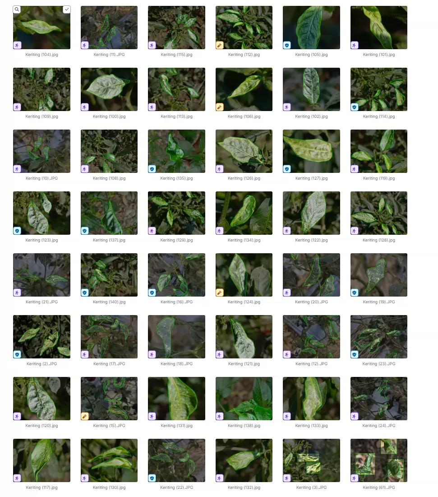
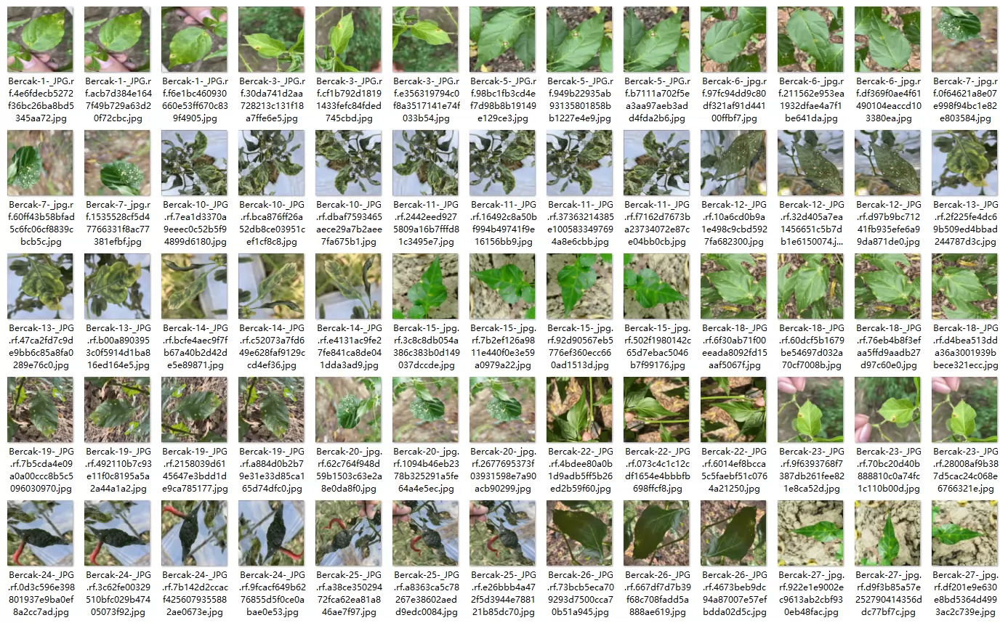
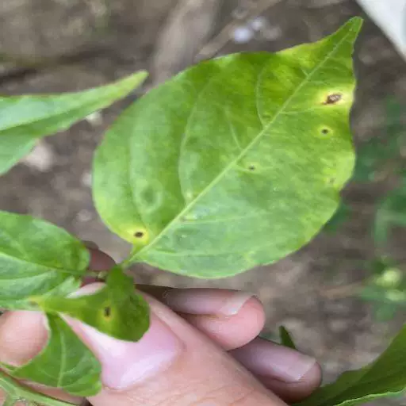
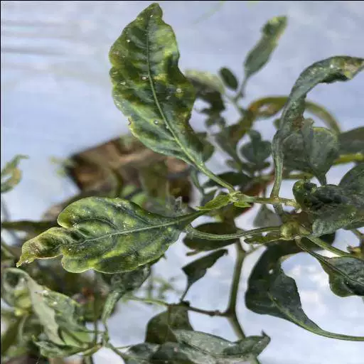
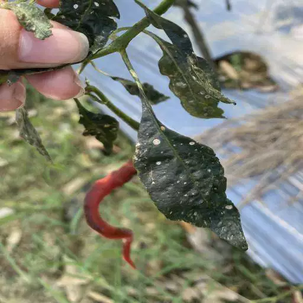
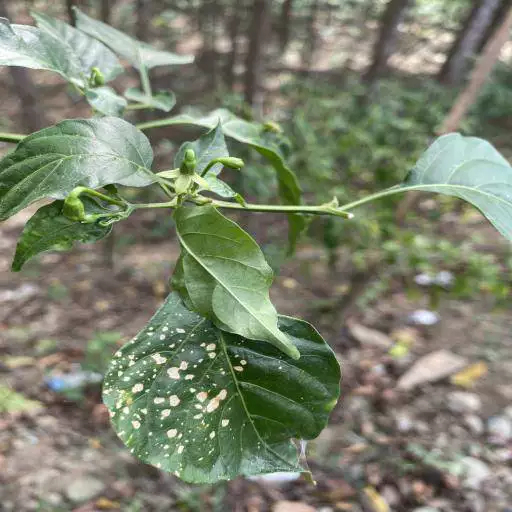

## Body

（Agricultural Product）Capsicum Disease Detection Dataset

A total of 1631 images are available, each labeled with YOLO format. The dataset is divided into training set (1445), test set (62), and validation set (124).
The dataset is categorized into five classes: Bercka', 'Keriting', 'Kuning', 'Sehat', 'Whitefly Spot Disease'.
For electronic virtual products, returns or exchanges are not accepted.

## Images

Here is a pay link on Stripe ( https://buy.stripe.com/3cs8yP7sY87d0vu9AB ). Please contact me lonlonago@foxmail.com after funding $89, and I will send you a complete data files , thank you!

